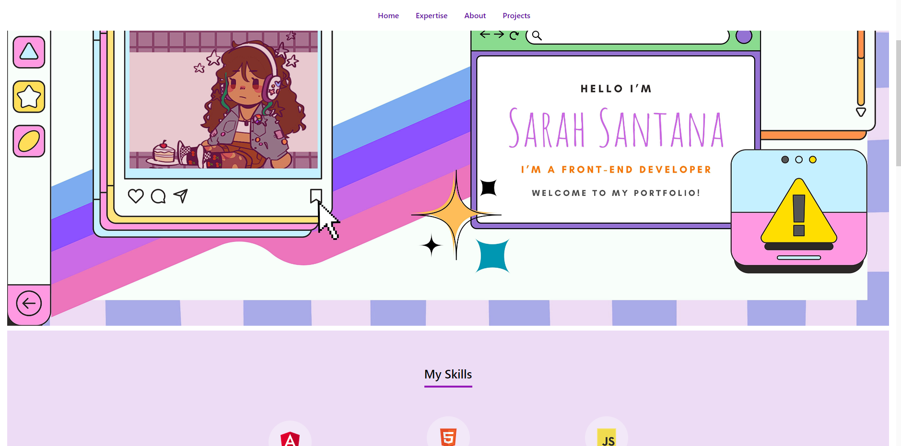

# SitePortfolio

<h2>Oiee, é a Sarah! bem vindos ao meu novo portfolio. ✨</h2>

 O primeiro foi totalmente diferente deste projeto, então por enquanto estou implementando novas ações para tornar o site mais interativo, responsivo e um pouco mais interessante visualmente. Espero que todos gostem e utilizem-no como base para seus projetos pessoais (sei que será de grande ajuda para os iniciantes ;P). Você está livre para dar um fork ou clonar este repositório e fazer suas próprias modificações!

<h2>Hey there, it's Sarah! welcome to my new portfolio. ✨</h2>

 The first one was totally different from this project, so for now, i'm implementing new actions to make the site more interactive, responsive and a li'l more visually interesting. I hope you all enjoy and use it as a basis for your personal projects (I know it will be of great help for beginners ;P). You're free to fork or clone this repository and make your own modifications!

This project was generated with [Angular CLI](https://github.com/angular/angular-cli) version 16.0.4.

## Development server

Run `ng serve` or `npm start` for a dev server. Navigate to `http://localhost:4200/`.

